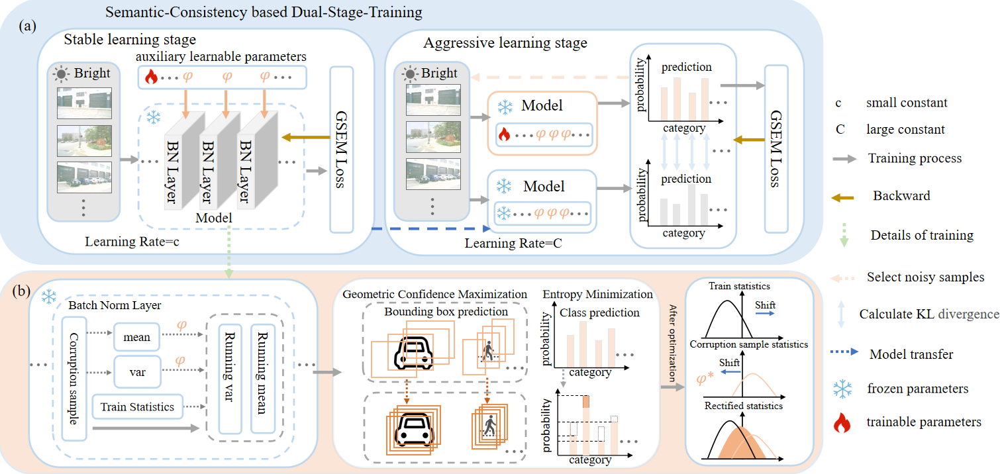

  
  <h3 align="center"><strong>Improving Batch Normalization with Test-Time Adaptation for Robust Object Detection in Self-Driving</strong></h3>

  

      <a href="https://scholar.google.com/citations?user=s1m55YoAAAAJ" target='_blank'>Dacheng Liao</a>&nbsp;&nbsp;
      <a href="https://scholar.google.com/citations?user=-j1j7TkAAAAJ" target='_blank'>Mengshi Qi</a>*&nbsp;&nbsp;
      <a href="https://scholar.google.com/citations?user=QDXADSEAAAAJ" target='_blank'>Liang Liu</a>*&nbsp;&nbsp;
      <a href="https://scholar.google.com/citations?user=YUKPVCoAAAAJ" target='_blank'>Huadong Ma</a>&nbsp;&nbsp;
     
    <small>State Key Laboratory of Networking and Switching Technology&nbsp;&nbsp;</small>
    <small>Beijing University of Posts and Telecommunications, China&nbsp;&nbsp;</small>

  

  
  

## Overview

## Updates

## Installation

## Data Preparation

## Getting Started

## Model Zoo

## Citation

## Acknowledgements

This work is developed based on the [Bevformer](https://github.com/fundamentalvision/BEVFormer) codebase.

